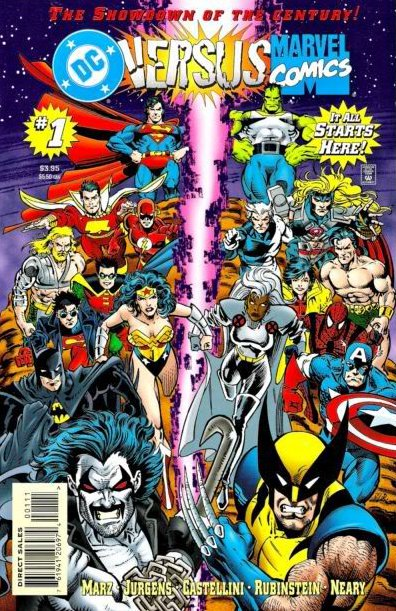

## Prompt

You are going to look into the raw data behind the story [Comic Books Are Still Made By Men, For Men And About Men](http://fivethirtyeight.com/features/women-in-comic-books/). 

The data come from [Marvel Wikia](http://marvel.wikia.com/Main_Page) and [DC Wikia](http://dc.wikia.com/wiki/Main_Page). Characters were scraped on August 24. Appearance counts were scraped on September 2. The month and year of the first issue each character appeared in was pulled on October 6.

- Is there any pattern around gender in the characters of comics?
- Is there any change over time?
- Does the company (DC vs. Marvel) have and effect?
- What can you say about "good characters" vs. "villains" in regards to their characteristics, gender, the company, over time?

marvel<-read.csv("marvel-wikia-data.csv") #Read Marvel data
dc<-read.csv("dc-wikia-data.csv") #Read DC data
colnames(marvel)[13]<-"YEAR" #Change last column to YEAR in Marvel to match YEAR in DC
dc$publisher<-"DC" #Add publisher col
marvel$publisher<-"Marvel" #Add publisher col
df<-rbind(dc, marvel) #Bind both tables into one data frame

summary(df$SEX)

df %>%
  group_by(YEAR) %>%
  summarise(females = count(SEX)) %>% 
  tail(2)

